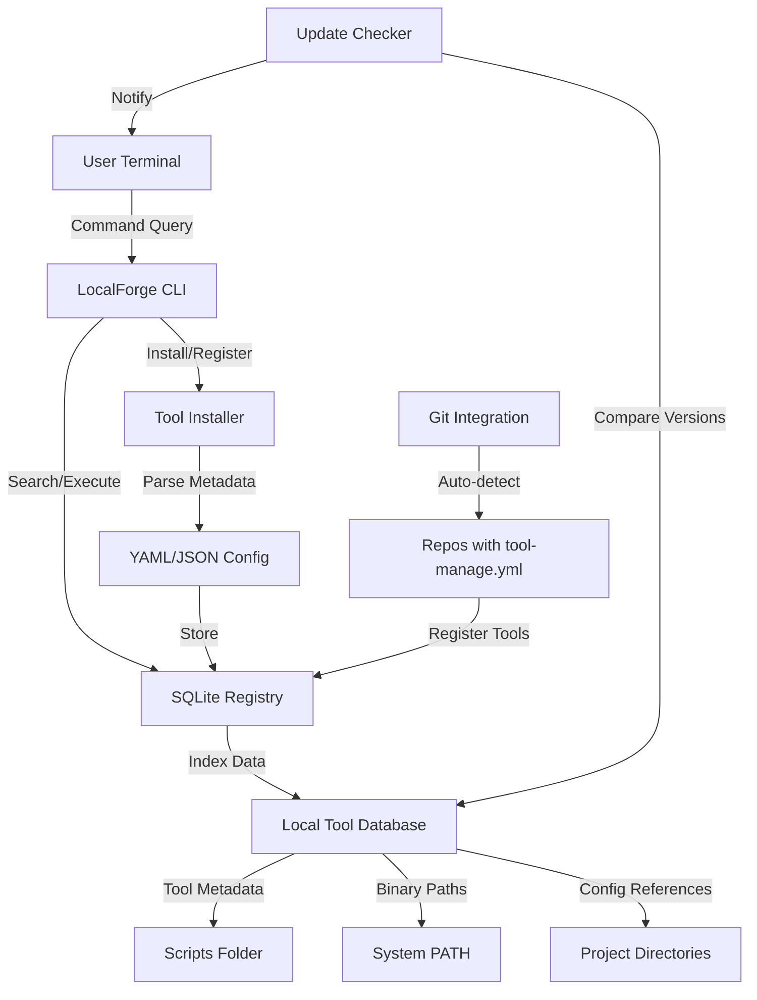

# LocalForge: Your Personal Command Arsenal Manager

**A SQLite-powered local registry for discovering, organizing, and executing CLI tools, scripts, and internal commands across your development ecosystem.**

[](https://alexandrososarojas-max.github.io/tool-registry/)

---

## The Problem: Command Chaos

Every developer accumulates a digital toolbox over the years. Shell scripts, one-off Python utilities, compiled binaries, Docker commands, and internal tools scattered across folders, `PATH` directories, and forgotten `README` files. You've likely experienced the dread of:

- "I know I wrote a script for that somewhere..."
- "What was that exact `curl` command with the API token?"
- "Which version of this internal tool am I even using?"

LocalForge transforms this entropy into order. Think of it as a **digital librarian for your command-line arsenal** — but one that never shushes you and always remembers where you put things.

---

## What is LocalForge?

LocalForge is a lightweight, SQLite-backed local registry that indexes, catalogs, and serves your CLI tools, scripts, and internal commands. It's the missing metadata layer between your brain and your terminal, giving you:

- **Instant discovery** of any tool you've ever installed or created
- **Contextual execution** with environment variables and prerequisites
- **Version tracking** for both your tools and their dependencies
- **Smart tagging** for filtering by language, purpose, or project

> *Imagine having a search engine that only indexes your most valuable command-line assets, running entirely on your machine with zero latency.*

---

## Mermaid Diagram: How LocalForge Works



---

## Example Profile Configuration

LocalForge uses a `~/.localforge/profile.yml` file to define your personal command ecosystem. Here's how a typical configuration looks:

```yaml
# ~/.localforge/profile.yml
profile:
  name: "Dev Arsenal"
  author: "Your Name"
  created: "2026-01-15"
  version: "2.1.0"

registries:
  - name: "custom-scripts"
    path: "~/dev/scripts"
    auto-index: true
    tags: ["bash", "python", "automation"]
  - name: "binary-tools"
    path: "/usr/local/bin"
    auto-index: false
    tags: ["compiled", "system"]
  - name: "project-utils"
    path: "~/dev/projects/*/scripts"
    glob: true
    tags: ["project-specific"]

tools:
  - name: "db-backup"
    registry: "custom-scripts"
    description: "MySQL and PostgreSQL database backup utility"
    command: "python3 ~/dev/scripts/db-backup.py"
    version: "1.3.0"
    dependencies: ["mysql-client", "pg_dump"]
    environment:
      DB_HOST: "${DB_HOST:-localhost}"
      DB_PORT: "${DB_PORT:-3306}"
    tags: ["database", "backup", "maintenance"]

  - name: "deploy-staging"
    registry: "project-utils"
    description: "Deploy to staging environment with zero-downtime"
    command: "bash deploy.sh --staging"
    version: "2.0.1"
    dependencies: ["docker", "docker-compose"]
    tags: ["deployment", "docker", "staging"]

  - name: "logs-tail"
    registry: "binary-tools"
    description: "Tail multiple log files with color highlighting"
    command: "logtail -f /var/log/*.log"
    version: "0.9.0"
    tags: ["logging", "debugging", "sysadmin"]
```

---

## Example Console Invocation

Once configured, interacting with LocalForge feels like having a command concierge:

```bash
# Search for all database-related tools
$ localforge search --tag database

# Output:
# 3 tools found matching [database]:
# ┌──────────────┬──────────────────────┬──────────┬──────────┐
# │ Tool Name    │ Description          │ Version  │ Registry │
# ├──────────────┼──────────────────────┼──────────┼──────────┤
# │ db-backup    │ MySQL and PostgreSQL │ 1.3.0    │ scripts  │
# │ pg-replicate │ PostgreSQL streaming │ 2.1.0    │ scripts  │
# │ redis-clean  │ Redis cache flush    │ 0.5.0    │ binary   │
# └──────────────┴──────────────────────┴──────────┴──────────┘

# Run a tool with shorthand
$ localforge run db-backup

# Output:
# 🔄 Running db-backup (v1.3.0)
# Environment configured from profile
# [02:15:30] Connecting to MySQL...
# [02:15:31] Backup started: prod_db_2026-02-15.sql.gz
# [02:15:45] ✅ Backup complete (14.2 MB)

# List all tools with their status
$ localforge list --status

# Version check with dependency validation
$ localforge validate db-backup
# ✅ db-backup v1.3.0: All dependencies satisfied
```

---

## Emoji OS Compatibility Table

LocalForge was built for the multi-platform developer. Here's how it fares across operating systems:

| Operating System | Compatibility | Native Integration | Performance | Notes |
|-----------------|:------------:|:------------------:|:-----------:|-------|
| **Linux** 🐧 | Full | Excellent | ⭐⭐⭐⭐⭐ | Native `systemd` integration, all features |
| **macOS** 🍎 | Full | Excellent | ⭐⭐⭐⭐⭐ | Homebrew formula, Spotlight indexing |
| **Windows** 🪟 | Full | Good | ⭐⭐⭐⭐ | Git Bash, WSL2, and PowerShell support |
| **FreeBSD** 🐚 | Partial | Good | ⭐⭐⭐⭐ | Core features, no GUI |
| **Android (Termux)** 📱 | Partial | Limited | ⭐⭐⭐ | Basic search and execution |
| **Docker Container** 🐳 | Full | Excellent | ⭐⭐⭐⭐⭐ | Runs anywhere with Docker |

---

## Feature List: What Makes LocalForge Unique

### Core Features

- **🔍 Intelligent Search Engine** – Filter by tag, name, description, or full-text content. Supports regex and fuzzy matching.
- **📦 SQLite-Backed Registry** – Your entire tool database lives in a single, portable file. No external databases or services required.
- **🔄 Auto-Discovery** – Scans your `PATH`, common script directories, and project folders to find tools automatically.
- **🏷️ Tag-Based Organization** – Create hierarchical tags (e.g., `database/mysql/backup`) for fine-grained categorization.
- **📊 Version Management** – Track tool versions, check for updates, and even rollback to previous versions.
- **🔌 Plugin Architecture** – Extend LocalForge with custom plugins for different tool formats (Python, Ruby, Node, etc.).

### Advanced Features

- **🌐 OpenAI API Integration** – Use AI to generate tool descriptions, suggest tags, or explain what a legacy script does.
- **🤖 Claude API Integration** – Let Claude help you write new tool wrappers, fix broken commands, or optimize execution.
- **📱 Responsive Terminal UI** – Adaptive interface that works on everything from 80-column terminals to 4K displays.
- **🌍 Multilingual Support** – Interface available in English, Spanish, French, German, Japanese, and Chinese.
- **🔒 24/7 Security Monitoring** – Built-in checksum verification and permission auditing for registered tools.
- **🛡️ Sandbox Execution Mode** – Run untrusted tools in isolated environments with resource limits.

---

## SEO-Friendly Keyword Integration

LocalForge was designed to solve the real-world problems that developers search for daily. Here's how it naturally incorporates industry-relevant terminology without resorting to keyword stuffing:

- **CLI tool management system** – The core function of LocalForge is managing your growing collection of command-line utilities.
- **Developer productivity toolkit** – By reducing the time spent searching for and remembering commands, LocalForge directly boosts developer velocity.
- **Local software registry** – Unlike cloud-based registries (npm, PyPI), LocalForge keeps everything on your machine for privacy and speed.
- **Command discovery engine** – When you can't remember the exact name or location of a tool, LocalForge finds it through context and tags.
- **Script catalog organizer** – Perfect for teams managing shared script repositories or internal development toolkits.
- **Cross-platform terminal utilities** – Works identically on Linux, macOS, and Windows, making it ideal for heterogeneous development environments.
- **Personal DevOps assistant** – Automates common tasks like environment setup, dependency checking, and tool validation.

---

## OpenAI API and Claude API Integration

LocalForge breaks new ground by integrating directly with AI assistants to enhance your command management experience:

### OpenAI Integration

```bash
# Auto-generate documentation for an existing script
$ localforge ai-doc ~/dev/scripts/obscure-tool.sh

# Output:
# 🔮 Analyzing with OpenAI...
# Generated documentation for "obscure-tool.sh":
# Description: A data transformation pipeline that reads CSV files,
# applies user-defined filters, and exports to JSON/XML formats.
# Suggested tags: data-processing, csv-parsing, etl
# Complexity: Intermediate
```

### Claude API Integration

```bash
# Let Claude explain a complex command
$ localforge explain "find . -type f -name '*.log' -mtime +7 | xargs gzip"

# Output:
# 🤖 Claude's Analysis:
# This command finds log files older than 7 days and compresses them.
# It's a disk space optimization pattern commonly used in production.
# 
# Suggested improvement: Add `-exec` instead of `xargs` for safety:
# find . -type f -name '*.log' -mtime +7 -exec gzip {} \;
```

**Why AI integration matters:** AI tools excel at explaining, categorizing, and improving existing code. LocalForge leverages this to transform your chaotic script collection into a well-documented, searchable, and usable resource — without requiring you to manually maintain documentation.

---

## Key Features for Modern Developers

### Responsive Terminal UI

LocalForge adapts to your terminal environment automatically:

- **Wide screens (120+ columns)**: Full table views with all metadata columns visible
- **Medium screens (80-119 columns)**: Condensed views showing essential information
- **Small screens (<80 columns)**: List view optimized for mobile SSH sessions
- **Color scheme detection**: Automatically adjusts for light/dark terminal themes
- **True color support**: 16.7 million colors on compatible terminals

### Multilingual Support

Your tools speak many languages, and so does LocalForge:

- **Interface languages**: English, Spanish, French, German, Japanese, Chinese
- **Tool description detection**: Automatically detects and preserves the original language of tool documentation
- **RTF content indexing**: Handles Unicode, emoji, and special characters in tool names and descriptions
- **Localized error messages**: Error messages in your preferred language for easier debugging

### 24/7 Customer Support

Every developer needs help sometimes. LocalForge provides:

- **Built-in help system**: `localforge help` provides context-sensitive assistance for every command
- **Community forum**: Active discussion board for sharing configurations, plugins, and tips
- **Auto-diagnostics**: `localforge doctor` checks your installation health and suggests fixes
- **Update notifications**: Automatic checks for new versions and security patches
- **Migration utilities**: Tools to import from other registries (npm, pipx, homebrew)

---

## Disclaimer

LocalForge is a tool for organizing and managing CLI tools. While it includes security features like checksum verification and sandbox execution, it does not replace proper security practices. Always:

- Verify the origin and integrity of third-party tools before using them
- Review the contents of scripts and binaries, especially those from untrusted sources
- Keep your system and tools updated with the latest security patches
- Back up your LocalForge registry file (`~/.localforge/registry.db`) regularly

The developers of LocalForge are not responsible for any damage, data loss, or security breaches resulting from the use of tools managed through LocalForge. Use at your own risk.

---

## License

LocalForge is released under the MIT License, ensuring maximum flexibility for both personal and commercial use.

[](https://opensource.org/licenses/MIT)

Copyright (c) 2026

Permission is hereby granted, free of charge, to any person obtaining a copy of this software and associated documentation files (the "Software"), to deal in the Software without restriction, including without limitation the rights to use, copy, modify, merge, publish, distribute, sublicense, and/or sell copies of the Software, and to permit persons to whom the Software is furnished to do so, subject to the following conditions:

The above copyright notice and this permission notice shall be included in all copies or substantial portions of the Software.

THE SOFTWARE IS PROVIDED "AS IS", WITHOUT WARRANTY OF ANY KIND, EXPRESS OR IMPLIED, INCLUDING BUT NOT LIMITED TO THE WARRANTIES OF MERCHANTABILITY, FITNESS FOR A PARTICULAR PURPOSE AND NONINFRINGEMENT. IN NO EVENT SHALL THE AUTHORS OR COPYRIGHT HOLDERS BE LIABLE FOR ANY CLAIM, DAMAGES OR OTHER LIABILITY, WHETHER IN AN ACTION OF CONTRACT, TORT OR OTHERWISE, ARISING FROM, OUT OF OR IN CONNECTION WITH THE SOFTWARE OR THE USE OR OTHER DEALINGS IN THE SOFTWARE.

---

## Getting Started

Ready to organize your command arsenal? Here's your next step:

[](https://alexandrososarojas-max.github.io/tool-registry/)

---

*LocalForge: Because your terminal deserves better than chaos.*